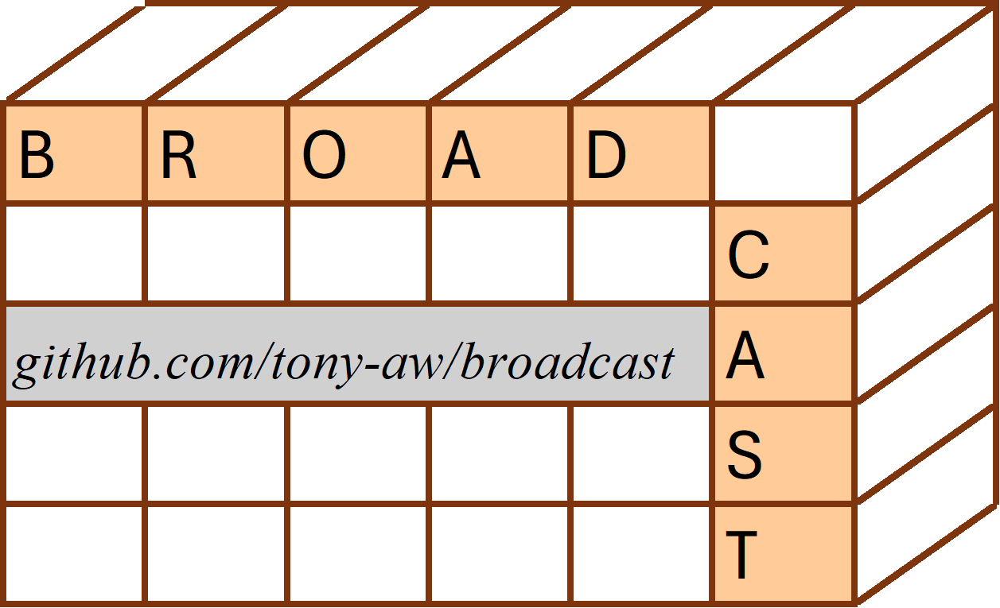

 
       <!-- badges: start -->

<!-- badges: end -->

# 🗺️Overview

The ‘broadcast’ package, as the name suggests, performs “broadcasting”
(similar to broadcasting in the ‘Numpy’ module for ‘Python’).

In the context of operations involving 2 (or more) arrays,
“broadcasting” refers to recycling arrays **without** allocating
additional memory, which is considerably **faster** and **more
memory-efficient** that R’s regular recycling mechanism.

Please read the article “Broadcasting explained” for a more complete
explanation of what “broadcasting” is.

 

At its core, the ‘broadcast’ package provides 3 functionalities, all 3
related to “broadcasting”:

 

First, ‘broadcast’ provides functions for element-wise outer
computations between any 2 arrays.  
These are similar to base R’s `outer()` function, but using
broadcasting, which is faster and more efficient than the recycling
employed by `outer()`.  
The outer-like functions provided by ‘broadcast’ are optimised for a
large set of operations, including, but not limited to, the following:

- relational operations (like ==, !=, \<, \>, \<=, \>=, etc.);
- arithmetic operations (like +, -, \*, /, ^, etc.);
- Boolean combiner operations (like &, \|, xor, etc.);
- string concatenation, string (in)equality, and string distance
  (Levenshtein) operations.

Note also, that base ‘R’ `outer()` function has some sloppy rules
regarding the dimensions of the output, making it hard to predict the
output shape.  
The outer-like functions provided by ‘broadcast’ have very strict
broadcasting rules, making it easy to accurately predict the dimensions
of the result.

 

Second, ‘broadcast’ provides the `bind_array()` function, which is an
broadcasted and enhanced form of the fantastic `abind::abind()`
function:

- `bind_array()` allows for broadcasting (obviously), whereas
  `abind::abind()` does not.
- `bind_array()` is significantly **faster** and uses **less memory**
  than `abind::abind()`.
- `bind_array()` also differs from `abind::abind()` in that it can
  handle recursive arrays properly; `abind::abind()` unlists everything
  to atomic arrays, ruining the structure.

 

Third, ‘broadcast’ provides several generic functions for broadcasting:

- `bcapply()`: a broadcasted apply-like function that works on pairs of
  arrays.
- `bc_ifelse()`: a broadcasted `ifelse()` function. Broadcasts between
  the `yes` and `no` arguments.

 

To get started, please visit the website: …

 

# 🤷🏽Why use ‘broadcast’

**Efficiency**

Broadcasting is faster and more memory efficient than recycling.  
This is not simply a need for speed.  
Efficient programs use less energy and resources, and is thus better for
the environment.  
As a favoured language for the sciences, ‘R’ should not throw away an
opportunity to become more efficient.

The Benchmarks show that ‘broadcast’ has a somewhat similar speed as
equivalent operations in ‘Numpy’.

 

**High Coverage**

The ‘broadcast’ package has been developed with a `set of unit tests`
that have high (\> 95%) coverage.

 

**Minimal Dependencies & High Consistency**

Besides linking to ‘Rcpp’, ‘broadcast’ does not depend on, vendor, link
to, include, or otherwise use any external libraries; ‘broadcast’ was
essentially made from scratch and can be installed out-of-the-box.

‘broadcast’ thus avoids “dependency hell”, bBut that is not the only
advantage of maintaining minimal dependencies.

All other alternatives to ‘broadcast’ (as far as I am aware), rely on
external libraries from other languages - like ‘Numpy’ or ‘xtensor’.
These cannot guarantee to behave consistent with R’s API.  
Since ‘broadcast’ does not depend any library from another language,
‘broadcast’ is able to remain consistent in its behaviour with the rest
of R’s API.

 

# 🔧Installation

…

 

 
