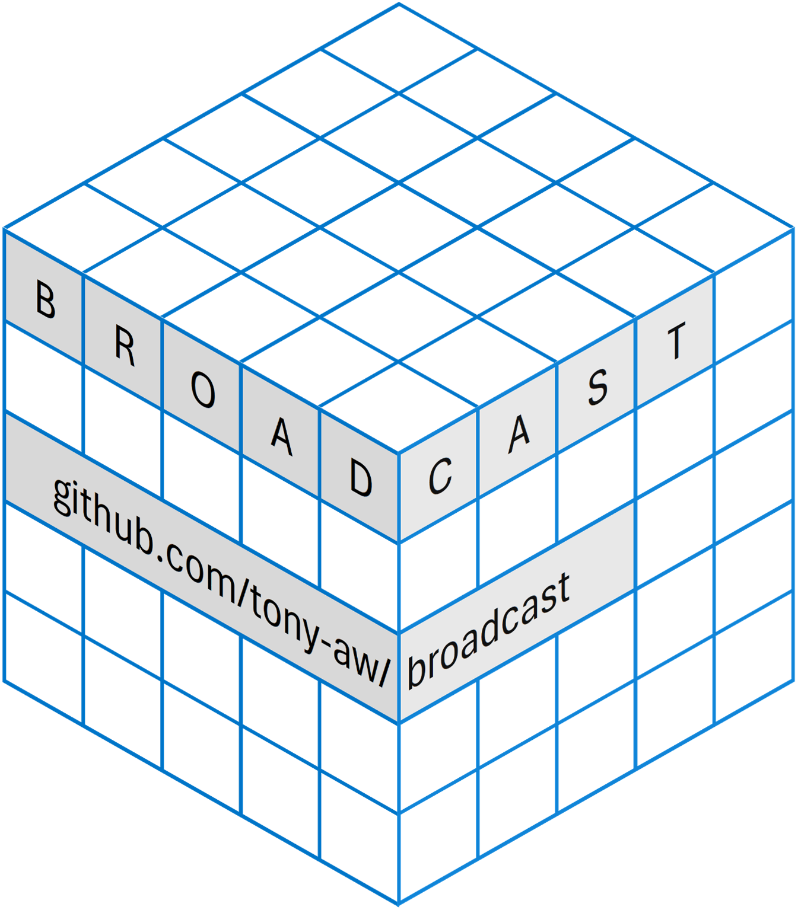

<p align="center">

</p>
<p align="center">
‘R’-package ‘broadcast’: Broadcasted Array Operations Like ‘NumPy’
</p>
<!-- badges: start -->

[](https://github.com/tony-aw/broadcast/actions)
[](https://www.repostatus.org/#active)
[](https://orcid.org/0000-0001-9498-8379)
[](https://cran.r-project.org/package=broadcast)
[](https://cran.r-project.org/package=broadcast)  
<!-- badges: end -->

 

## 🗺️Overview

‘broadcast’ is an efficient ‘C’/‘C++’ - based ‘R’ package that, as the
name suggests, performs “array broadcasting” (similar to broadcasting in
the ‘Numpy’ module for ‘Python’).

In the context of operations involving 2 (or more) arrays,
“broadcasting” refers to efficiently recycling array dimensions, without
making copies.  
This is considerably **faster** and **more memory-efficient** than R’s
regular dimensions replication mechanism.

At its core, the ‘broadcast’ package provides the following
functionalities, all related to “broadcasting” (click on the 🔍 to show
or hide):

<details>
<summary>
<b><a style="cursor: pointer;">Broadcasted Infix Operators 🔍 </a></b>
</summary>

Consider the arrays `x` and `y`:

``` r
(x <- array(1:15, c(3, 5)))
#>      [,1] [,2] [,3] [,4] [,5]
#> [1,]    1    4    7   10   13
#> [2,]    2    5    8   11   14
#> [3,]    3    6    9   12   15
(y <- array(1:5 * 100, c(1, 5)))
#>      [,1] [,2] [,3] [,4] [,5]
#> [1,]  100  200  300  400  500
```

Suppose one wishes to compute the element-wise addition of these 2
arrays.  
As show in the table below, this cannot be done efficiently in base ‘R’;
it **can** be done fast and memory-efficiently with the ‘broadcast’
package:

<table>
<tr>
<td height="1">
Base ‘R’
</th>
<td height="1">
‘broadcast’ package
</th>
</tr>
<tr>
<td>

``` r
x + y
Error in x + y : non-conformable arrays

# You *could* do the following....
x + y[rep(1L, 3L),]
# ... but if x or y is very large: 
Error: cannot allocate vector of size
```

</td>
<td>

``` r
broadcaster(x) <- TRUE
broadcaster(y) <- TRUE
x + y
#>      [,1] [,2] [,3] [,4] [,5]
#> [1,]  101  204  307  410  513
#> [2,]  102  205  308  411  514
#> [3,]  103  206  309  412  515
#> broadcaster
```

</td>
</tr>
</table>

‘broadcast’ supports a wide range of infix operators, including
arithmetic-, relational-, Boolean- string- and bit-wise operators.

</details>
<details>
<summary>
<b><a style="cursor: pointer;">Broadcasted Array Binding 🔍 </a></b>
</summary>

Using broadcasting, `bind_array()` from the ‘broadcast’ package can bind
arrays together in ways that cannot efficiently be done with `rbind()`,
`cbind()`, or `abind::abind()`. Let’s consider these arrays:

``` r
(x <- array(1:12, c(3, 4)))
#>      [,1] [,2] [,3] [,4]
#> [1,]    1    4    7   10
#> [2,]    2    5    8   11
#> [3,]    3    6    9   12
(y <- array(1:4 * 100, c(1, 4)))
#>      [,1] [,2] [,3] [,4]
#> [1,]  100  200  300  400
```

Suppose one wishes to column-bind these 2 arrays.  
As show in the table below, this cannot be done efficiently in base ‘R’;
it **can** be done fast and memory-efficiently with the ‘broadcast’
package:

<table cellspacing="0" cellpadding="0">
<tr>
<td>
Base ‘R’
</th>
<td>
‘broadcast’ package
</th>
</tr>
<tr>
<td>

``` r
cbind(x, y)
Error in cbind(x, y) :
  number of rows of matrices must match (see arg 2)

# You *could* do the following....
cbind(x, y[rep(1L, 3L),])
# ... but if x or y is very large:
Error: cannot allocate vector of size
```

</td>
<td>

``` r
bind_array(list(x, y), along = 2L)
#>      [,1] [,2] [,3] [,4] [,5] [,6] [,7] [,8]
#> [1,]    1    4    7   10  100  200  300  400
#> [2,]    2    5    8   11  100  200  300  400
#> [3,]    3    6    9   12  100  200  300  400
```

</td>
</tr>
</table>

`bind_array()` is also considerably faster and more memory efficient
than `abind()`. See the
[benchmarks](https://tony-aw.github.io/broadcast/about/f_benchmarks_other.html).

</details>
<details>
<summary>
<b><a style="cursor: pointer;">Broadcasted General Functions 🔍 </a></b>
</summary>

The idea of broadcasted infix operations and broadcasted array binding
has been generalized to also include `bcapply()` (a broadcasted
apply-like function), `bc_ifelse()` (broadcasted version of `ifelse()`),
`bc_strrep()` (broadcasted version of `strrep()`).

</details>
<details>
<summary>
<b><a style="cursor: pointer;">Casting Methods 🔍 </a></b>
</summary>

Broadcast provides casting functions, that cast subset-groups of an
array to a new dimension, cast nested lists to dimensional lists, and
vice-versa.  
These functions are useful for facilitating complex broadcasted
operations, though they also have much merit beside broadcasting.

For example, you cannot broadcast through hierarchies of a list, but you
**can** broadcast along dimensions. So suppose you have the following
list:

``` r
x <- list(
  student1 = list(
    homework1 = sample(0:100, 5),
    homework2 = sample(0:100, 5),
    homework3 = sample(0:100, 5)
  ),
  student2 = list(
    homework1 = sample(0:100, 5),
    homework2 = sample(0:100, 5),
    homework3 = sample(0:100, 5)
  ),
  student3 = list(
    homework1 = sample(0:100, 5),
    homework2 = sample(0:100, 5),
    homework3 = sample(0:100, 5)
  )
)
```

Since all values in the list are numbers, you might want to turn this
into a numeric array, to make mathematical computations and analyses on
it easier.

This can be done with the ‘broadcast’ package with the following steps.
First, turn the nested list into a shallow (i.e. non-nested),
dimensional list using `cast_hier2dim()`:

``` r
x2 <- cast_hier2dim(x, in2out = FALSE, direction.names = 1L)
print(x2)
#>          homework1 homework2 homework3
#> student1 integer,5 integer,5 integer,5
#> student2 integer,5 integer,5 integer,5
#> student3 integer,5 integer,5 integer,5
```

Second, turn the shallow (i.e. non-nested), dimensional list into an
atomic array using `cast_shallow2atomic()`:

``` r
x3 <- cast_shallow2atomic(x2, 1L)
print(x3)
#> , , homework1
#> 
#>      student1 student2 student3
#> [1,]       67        6       73
#> [2,]       38       72       41
#> [3,]        0       78       37
#> [4,]       33       84       19
#> [5,]       86       36       27
#> 
#> , , homework2
#> 
#>      student1 student2 student3
#> [1,]       42       88       19
#> [2,]       13       36       43
#> [3,]       81       33       86
#> [4,]       58      100       69
#> [5,]       50       43       39
#> 
#> , , homework3
#> 
#>      student1 student2 student3
#> [1,]       96       78       43
#> [2,]       84       32       24
#> [3,]       20       83       69
#> [4,]       53       34       38
#> [5,]       73       69       50
```

</details>
<details>
<summary>
<b><a style="cursor: pointer;">A few Linear Algebra Functions for
Statistics 🔍 </a></b>
</summary>

‘broadcast’ comes with a few linear algebra functions for statistics.
For example, the `sd_lc()` function to compute the standard deviation of
a linear combination of variables - regardless of what the distribution
of the variables is.

</details>

**The Quick-Start Guide can be found
[here](https://tony-aw.github.io/broadcast/vignettes/b_quickstart.html).**

**Some Practical Examples of the ‘broadcast’ package in action can be
found
[here](https://tony-aw.github.io/broadcast/vignettes/practical_applications.html).**

 

## 🤷🏽Why use ‘broadcast’

**Efficiency**

Broadcasting as implemented in the ‘broadcasting’ package is about as
fast as - and sometimes even faster than - NumPy.  
The implementations in the ‘broadcast’ package are also much faster and
much more memory efficient than using base ‘R’ solutions like
`sweep()`.  
Efficient programs use less energy and resources, and is thus better for
the environment.  
Benchmarks can be found in the “About” section on the website.

 

**Convenience**

Have you ever been bothered by any of the following while programming in
‘R’:

- Receiving the “non-conformable arrays” error message in a simple array
  operation, when it intuitively should work?
- Receiving the “cannot allocate vector of size…” error message because
  ‘R’ unnecessarily allocated too much memory in array operations?
- `abind::abind()` being too slow, or ruining the structure of recursive
  arrays?
- The `sweep()` and `outer()` functions being too slow or too limiting?
- that there is no array analogy to `data.table::dcast()`?
- difficulties in handling deeply nested lists?
- that certain ‘Numpy’ operations have no equivalent operation in ‘R’?

If you answered “YES” to any of the above, ‘broadcast’ may be the ‘R’ -
package for you.

 

**Minimal Dependencies**

Besides linking to ‘Rcpp’, ‘broadcast’ does not depend on, vendor, link
to, include, or otherwise use any external libraries; ‘broadcast’ was
essentially made from scratch and can be installed out-of-the-box.

Not using external libraries brings a number of advantages:

- Avoid dependency hell.
- Avoid wasting time, memory and computing resources for translating
  between language structures.
- Ensure consistent behaviour with the rest of ‘R’.
- Access to CRAN’s quality control (no comparable quality control
  organization exists for most other programming languages).

See the [Other
Packages](https://tony-aw.github.io/broadcast/about/d_other_pkgs.html)
page for more details on the above points regarding the advantages of
minimizing dependencies.

 

**Tested**

The ‘broadcast’ package is frequently checked using a large suite of
unit tests via the [tinytest](https://github.com/markvanderloo/tinytest)
package. These tests have a
[coverage](https://tony-aw.github.io/broadcast/about/g_unit_test_covr.html)
of over 90%. So the chance of a function from this package breaking
completely is relatively low.

‘broadcast’ is still relatively new package, however, so (small) bugs
are still very much possible. I encourage users who find bugs to report
them promptly to the
[issues](https://github.com/tony-aw/broadcast/issues) tab on the GitHub
page, and I will fix them as soon as time permits.

 

## 🔧Installation

``` r

install.packages("broadcast", type = "source")
```

 

 

## 📊Status

‘broadcast’ is now available on CRAN! 🎉

If you have any suggestions or feedback on the package, its
documentation, or even the benchmarks, I encourage you to let me know
(either as an [Issue](https://github.com/tony-aw/broadcast/issues) or a
[Discussion](https://github.com/tony-aw/broadcast/discussions)).  
I’m eager to read your input!

 

## 📖Documentation

The documentation in the ‘broadcast’ website is divided into 3 main
parts:

- [Guides and
  Vignettes](https://tony-aw.github.io/broadcast/vignettes/a_readme.html):
  contains the topic-oriented guides in the form of a few Vignettes.
- [Reference
  Manual](https://tony-aw.github.io/broadcast/man/aaa00_broadcast_help.html):
  contains the function-oriented reference manual.
- [About](https://tony-aw.github.io/broadcast/about/a_acknowledgements.html):
  Contains the Acknowledgements, Change logs and License file. Here
  you’ll also find some information regarding the relationship between
  ‘broadcast’ and other packages/modules. Benchmarks can also be found
  here.

   
